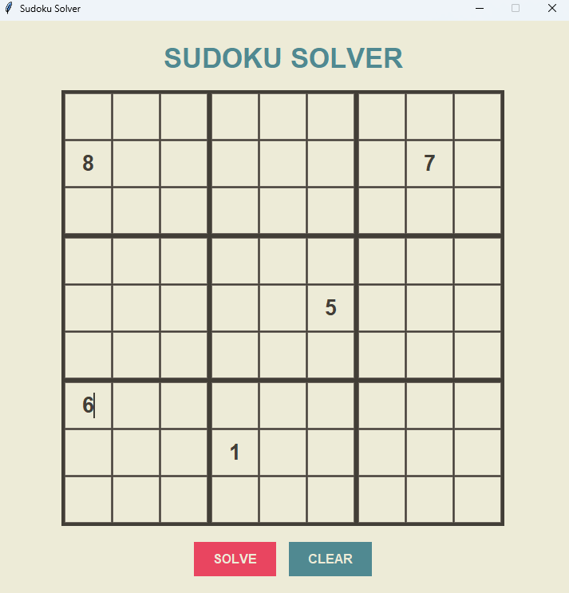

# Sudoku Solver

> A Sudoku solver written in C with a Python GUI frontend.


---

## Features

- **Solver written in C** using bitmask techniques and constraint propagation
- **MRV** (Minimum Remaining Values) to minimize backtracking
- **Naked singles** detection for efficient solving
- **Python GUI** for an easy, interactive experience



---

## Getting Started

### Prerequisites
- GCC (or any C compiler)
- Python 3.x with `tkinter`

### Installation

**1. Clone the repository**
```bash
git clone https://github.com/iiEliJas/SuSoGUI.git
```

**2. Compile the C library**
```bash
gcc -O2 -shared -fPIC -o lib/sudoku.so src/sudoku.c
```

**3. Launch the GUI**
```bash
python sudokuUI.py
```

---

## Project Structure

```
SuSoGUI/
├── src/
│   └── sudoku.c        # Core solver (C)
├── lib/
│   └── sudoku.so       # Compiled shared library
└── sudokuUI.py         # Python GUI (tkinter)
```

---

## How It Works

The solver (`src/sudoku.c`) is compiled as a shared library and called in `sudoku.py` via `ctypes`. The GUI is built with **tkinter**. The solver works with:

- **Bitmasks** to track digit usage across rows, columns and boxes in O(1)
- **Constraint propagation** to fill forced cells before branching
- **Backtracking** with MRV to pick the best cells first

---

## License

Distributed under the [MIT License](LICENSE).
